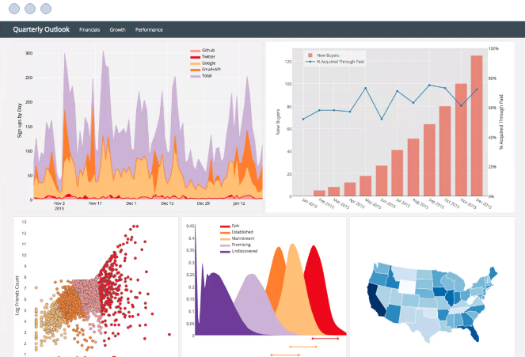

# Digital Humanites
* Thomas Miller

[Click Here to See the Repo](https://github.com/ThomasMillerJ/dh1-first-assignment)



Lorem ipsum dolor sit amet, consectetur adipiscing elit. Ut felis sem, iaculis vitae lacus condimentum, bibendum gravida sem. Suspendisse eget pharetra ligula. Proin at dolor nunc. Quisque sit amet erat et felis bibendum varius at nec dui. Vestibulum rutrum mattis magna, nec vehicula orci imperdiet sit amet. Mauris venenatis pharetra elit in sodales. Pellentesque sagittis justo vitae dui pharetra molestie.

```json
{
    "_id": "dh-thomasmillar",
    "startUrl": ["https://georgia.gov/municipality-list"],
    "selectors": [{
            "id": "counties",
            "type": "SelectorLink",
            "parentSelectors": ["country-row"],
            "selector": "a",
            "multiple": false,
            "delay": 0
        },
        {
            "id": "county",
            "type": "SelectorText",
            "parentSelectors": ["counties"],
            "selector": "h1",
            "multiple": false,
            "regex": "",
            "delay": 0
        },
        {
            "id": "Website",
            "type": "SelectorText",
            "parentSelectors": ["counties"],
            "selector": "div.field-name-field-website",
            "multiple": false,
            "regex": "",
            "delay": 0
        },
        {
            "id": "Incorporated Date",
            "type": "SelectorText",
            "parentSelectors": ["counties"],
            "selector": "div.field-name-field-muni-date",
            "multiple": false,
            "regex": "",
            "delay": 0
        }, {
            "id": "Population",
            "type": "SelectorText",
            "parentSelectors": ["counties"],
            "selector": "div.field-name-field-population",
            "multiple": false,
            "regex": "",
            "delay": 0
        }, {
            "id": "Total Area ",
            "type": "SelectorText",
            "parentSelectors": ["counties"],
            "selector": "div.field-name-field-total-area",
            "multiple": false,
            "regex": "",
            "delay": 0
        },
        {
            "id": "country-row",
            "type": "SelectorElement",
            "parentSelectors": ["_root"],
            "selector": "td.views-field-field-associated-muni",
            "multiple": true,
            "delay": 0
        }
    ]
}
```

